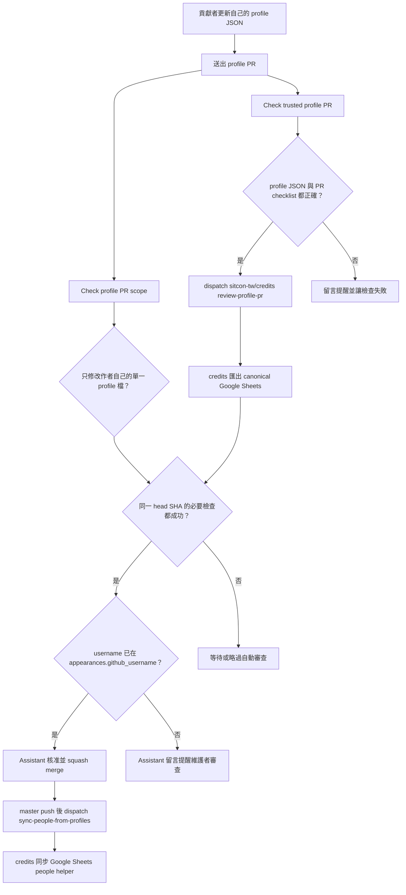

# 自助 profile PR 流程

這份文件給想新增或更新自己 profile 的貢獻者、review profile PR 的維護者，以及想理解 `credits-profiles` 自動化的人閱讀。

## 一般自助更新

自助 PR 可以自動核准與合併的前提：

- PR 只修改作者自己的單一 `profiles/<github_username>.json`。
- profile JSON 符合 schema 與資料最小化規則。
- PR template 中必要的公開資料與內容安全確認事項已勾選。
- `sitcon-tw/credits` canonical Google Sheets 的 `appearances.github_username` 已經有這個 username。
- 同一個 head SHA 的 `Check profile PR scope` 與 `Check trusted profile PR` 都成功。

自動合併只代表 profile PR 符合低風險自助更新條件。它不代表 workflow 建立了新的身份連結，也不代表它處理了歷史資料更正、profile 刪除、profile rename 或隱私政策例外。

## 需要維護者 review 的情況

以下 PR 不屬於低風險自助更新：

- 刪除 profile。
- rename profile。
- 修改別人的 profile。
- 同時修改多個 profile。
- 修改 `_template.json`、schema、workflow、script、docs 或其他支援檔案。
- 要求移除 profile 資料、解除歷史 appearance 連結或更改隱私政策。
- 要求新增、改寫、拆分或合併歷史活動紀錄。

維護者若確認這些變更的 profile 範圍可以接受，應加上 `profile-scope-reviewed` label。這個 label 只代表維護者審查過 PR 範圍，不代表身份合併、歷史紀錄修正或隱私請求已被核准。

## Branch Ruleset 建議

profile self-service 的 branch protection 或 ruleset 應要求：

- `Check trusted profile PR`
- `Check profile PR scope`
- 專案預期的 profile review policy

不要要求一般 `CI` 作為 profile PR 必要檢查，因為一般 `pull_request` CI 刻意不在 fork PR 上啟用，以避免 workflow approval 讓自助 profile PR 卡住。`CI` 仍會在 `master` push 與手動觸發時執行測試與 profile 格式驗證。

## 與主 repo 的 dispatch

`credits-profiles` 不保存 canonical Google Sheets credentials。需要讀取 canonical appearances 或同步 `people` helper sheet 的動作，都 dispatch 到 [`sitcon-tw/credits`](https://github.com/sitcon-tw/credits) 執行。

目前有兩個跨 repo dispatch：

- `review-profile-pr`：由 `Trusted profile review` 送出，請主 repo 根據 canonical appearances 決定是否核准、合併或留言。
- `sync-people-from-profiles`：由 `Sync credits people helper` 在 `profiles/*.json` merge 到 `master` 後送出，請主 repo 將 profile username 與 display name 同步到 Google Sheets 的 `people` helper sheet。

這兩個 dispatch 都應使用 `SITCON Credits Assistant` GitHub App，不應使用維護者個人 token。
