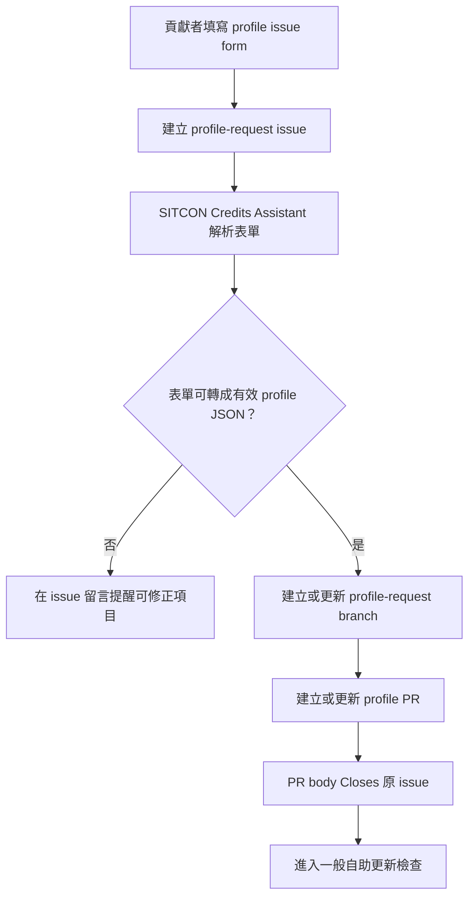
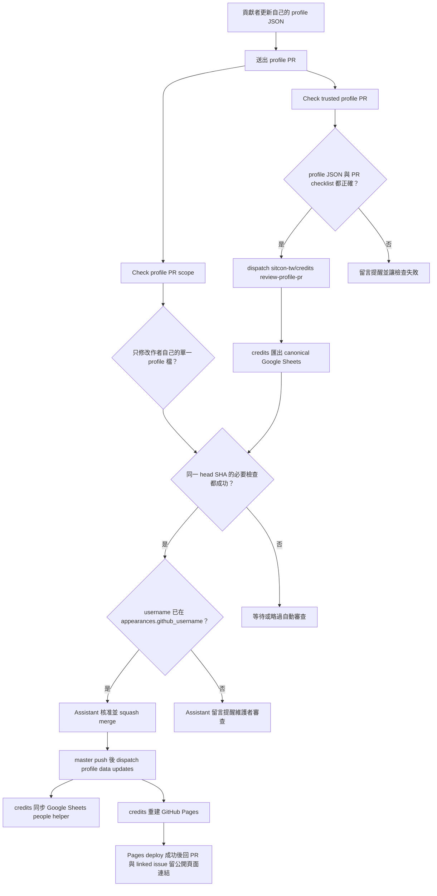

# 自助 profile PR 流程

這份文件給想新增或更新自己 profile 的貢獻者、review profile PR 的維護者，以及想理解 `credits-profiles` 自動化的人閱讀。

`site-profiles/` 是維護者從歷屆活動公開網站整理出的顯示用資料，只接受直接 commit，不屬於自助 profile PR 流程。

## GitHub 表單協助入口

表單入口適合不熟 JSON 或不想手動 fork/開 PR 的貢獻者。GitHub issue form 只會建立 issue，不支援直接建立 Pull Request；因此這個 repo 使用 `Profile issue request` workflow 由 `SITCON Credits Assistant` 讀取 issue body，使用 issue 作者的 GitHub username 產生 `profiles/<github_username>.json`，再建立或更新 PR。系統會在原 issue 留下 PR 連結；若後續等待維護者確認歷史貢獻紀錄連結，或 Pages 部署完成，也會回到原 issue 通知建立者。

若貢獻者想請維護者確認哪些公開貢獻紀錄可能是在記錄自己，建議先打開 [標記我的貢獻紀錄](http://sitcon.org/credits/?claim=1)。頁面會產生可帶入 issue form 的標記網址；這個網址只會出現在 issue 與 PR 說明中，供維護者 review canonical appearances，不會由 `credits-profiles` workflow 自動改寫歷史紀錄或完成身份合併。

因為 PR 作者會是 `sitcon-credits[bot]`，不是填表者本人，`Check profile PR scope` 和 `Check trusted profile PR` 會在符合下列條件時，改用原始 issue 作者作為自助流程 owner：

- PR 作者是 `sitcon-credits[bot]`。
- PR body 使用 `Closes #...` 連到同 repo issue。
- 該 issue 有 `profile-request` label。
- profile 檔名中的 GitHub username 來自 issue 作者。

其他 PR 仍使用 PR 作者作為 owner。這個例外只讓表單入口能沿用既有低風險自助檢查，不代表 assistant 可以替任意使用者提交 profile，也不代表身份合併已被核准。

## 一般自助更新

自助 PR 可以自動核准與合併的前提：

- PR 只修改作者自己的單一 `profiles/<github_username>.json`。
- profile JSON 符合 schema 與資料最小化規則。
- PR template 中必要的公開資料與內容安全確認事項已勾選。
- `sitcon-tw/credits` canonical Google Sheets 的 `appearances.github_username` 已經有這個 username。
- PR 或 linked issue 內沒有仍待維護者確認並寫入 Sheet 的 `site:` 標記網址。
- 同一個 head SHA 的 `Check profile PR scope` 與 `Check trusted profile PR` 都成功。

自動合併只代表 profile PR 符合低風險自助更新條件。它不代表 workflow 建立了新的身份連結，也不代表它處理了歷史資料更正、profile 刪除、profile rename 或隱私政策例外。

如果 `Check profile PR scope` 或 `Check trusted profile PR` 沒有通過，bot 會在 PR 留言中指出失敗的項目與可採取的修正方式；修正後重新 push，通過檢查時先前的提醒留言會自動移除。

## 需要維護者 review 的情況

以下 PR 不屬於低風險自助更新：

- 刪除 profile。
- rename profile。
- 修改別人的 profile。
- 同時修改多個 profile。
- 修改 `_template.json`、schema、workflow、script、docs 或其他支援檔案。
- 修改 `site-profiles/`。
- 要求移除 profile 資料、解除歷史 appearance 連結或更改隱私政策。
- 要求新增、改寫、拆分或合併歷史活動紀錄。

維護者若確認這些變更的 profile 範圍可以接受，應加上 `profile-scope-reviewed` label。這個 label 只代表維護者審查過 PR 範圍，不代表身份合併、歷史紀錄修正或隱私請求已被核准。`site-profiles/` 不使用這個 label 開放 PR；若要更新，應由維護者直接 commit 到 repository。

## Branch Ruleset 建議

profile self-service 的 branch protection 或 ruleset 應要求：

- `Check trusted profile PR`
- `Check profile PR scope`
- 專案預期的 profile review policy

不要要求一般 `CI` 作為 profile PR 必要檢查，因為一般 `pull_request` CI 刻意不在 fork PR 上啟用，以避免 workflow approval 讓自助 profile PR 卡住。`CI` 仍會在 `master` push 與手動觸發時執行測試與 profile 格式驗證。

## 與主 repo 的 dispatch

`credits-profiles` 不保存 canonical Google Sheets credentials，也不直接部署 GitHub Pages。需要讀取 canonical appearances、同步 `people` helper sheet 或重建 Pages 的動作，都 dispatch 到 [`sitcon-tw/credits`](https://github.com/sitcon-tw/credits) 執行。

有三個跨 repo dispatch：

- `review-profile-pr`：由 `Trusted profile review` 送出，請主 repo 根據 canonical appearances 決定是否核准、合併或留言。
- `apply-profile-claims`：由 `Confirm profile claim links` 在維護者勾選 claim confirmation comment 的確認 checkbox 後送出，請主 repo 重新驗證 PR 標記網址與 canonical Sheet，確認後才更新 `appearances.github_username`。
- `sync-people-from-profiles`：由 `Sync credits people helper` 在 `profiles/*.json` merge 到 `master` 後送出，請主 repo 將 profile username 與 display name 同步到 Google Sheets 的 `people` helper sheet。
- `rebuild-pages-from-profiles`：由 `Sync credits profile data` 在 `profiles/*.json` merge 到 `master` 後送出，請主 repo 重新匯出 canonical Sheet、讀取最新 `credits-profiles`，並部署 GitHub Pages。

這些 dispatch 都應使用 `SITCON Credits Assistant` GitHub App，不應使用維護者個人 token。

`Confirm profile claim links` 只驗證 GitHub 上勾選 confirmation comment 的使用者對 `credits-profiles` 有 write、maintain 或 admin 權限，並把 PR number、head SHA 與確認 comment id dispatch 到主 repo。它不讀取 Google Sheets credentials，也不在本 repo 直接修改 canonical appearances；實際寫入與資料驗證仍由 `sitcon-tw/credits` 完成。

`Sync credits profile data` 會在能辨識單一 merged profile PR 時，把 PR number 與 profile username 放進 Pages rebuild dispatch。主 repo 只有在 Pages deploy 成功後才回到該 PR 留言；若 PR linked 到 profile request issue，也會回到原 issue 留言，提供 `https://sitcon.org/credits/#person=<github_username>` 讓貢獻者查看公開呈現。

`site-profiles/**` 的變更不會觸發 `sync-people-from-profiles` 或 `rebuild-pages-from-profiles`，也不會被當作 contributor-owned profile username。
